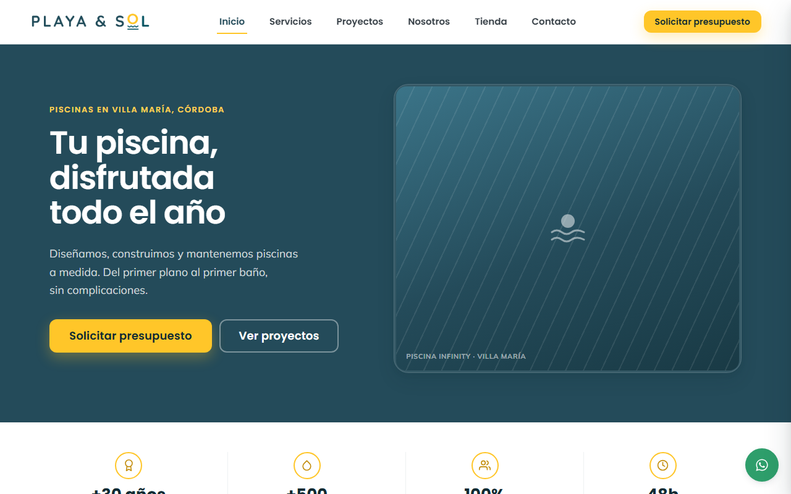
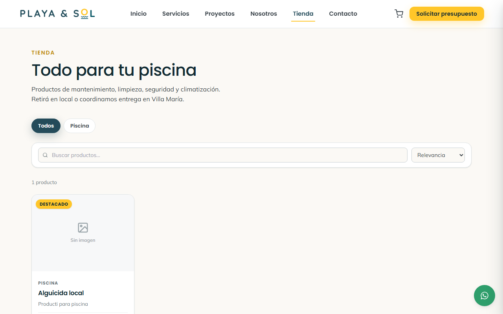

<div align="center">

# Playa y Sol — Sitio institucional + E-commerce

**Plataforma full-stack MERN en producción para un negocio real de piscinas.**
Sitio institucional, tienda con checkout por WhatsApp y panel de administración con métricas y auditoría.

[**Ver demo en producción →**](https://playaysol.vercel.app/)




</div>

---

## Qué es

Playa y Sol es una empresa de construcción y mantenimiento de piscinas de Villa María, Córdoba, con más de 30 años de trayectoria. Este proyecto es su presencia digital completa:

- **Sitio institucional** que presenta servicios y obras terminadas, y capta consultas.
- **Tienda online** de productos de mantenimiento, con carrito y cierre por WhatsApp.
- **Panel de administración** desde donde el dueño edita todo el contenido del sitio sin tocar código ni esperar un deploy.

No es un proyecto de práctica: está en producción y lo usa el negocio todos los días. Las decisiones técnicas están tomadas en función de eso.

---

## Stack

| Capa | Tecnologías |
|---|---|
| **Frontend** | React 18, Vite 5, React Router 6, Axios, Recharts |
| **Estilos** | Sistema de diseño propio en variables CSS + Tailwind, ambos alimentados por una única paleta de marca |
| **Backend** | Node.js, Express 4, MongoDB + Mongoose 8, JWT |
| **Testing** | Vitest + Testing Library (57 tests) |
| **Integraciones** | Cloudinary (imágenes), Nodemailer (notificaciones), WhatsApp (checkout y consultas) |
| **Infraestructura** | Vercel (SPA estática + API serverless), MongoDB Atlas |
| **Seguridad** | Helmet, rate limiting diferenciado por método, `express-mongo-sanitize`, bcrypt, auditoría de acciones |

---

## Funcionalidades

### Sitio público

- **Inicio** con hero, franja de trayectoria, servicios, obras destacadas y productos destacados — todo el contenido se administra desde el panel.
- **Tienda** con búsqueda con *debounce*, filtros por categoría, ordenamiento y paginación del lado del servidor.
- **Carrito** persistente en `localStorage`, con validación de stock y saneamiento de los datos guardados al recuperarlos.
- **Checkout sin pasarela de pago**: valida stock en tiempo real, lo descuenta de forma atómica y arma el mensaje de WhatsApp con el detalle del pedido.
- **Proyectos** con galería y *lightbox*, y **Servicios**, ambos gestionables.
- **Presupuesto y contacto**: guardan la consulta en base de datos y disparan un email de notificación antes de abrir WhatsApp, para que ningún contacto se pierda si el visitante abandona a mitad de camino.

### Panel de administración (`/admin`, protegido con JWT)

- CRUD de productos, servicios y proyectos, con carga de imágenes a Cloudinary y reordenamiento.
- Gestión de categorías, con propagación del renombrado a los productos y bloqueo del borrado si están en uso.
- Seguimiento de pedidos y de consultas, con cambio de estado.
- Dashboard único con los KPIs del negocio y evolución de pedidos.
- Configuración general (contacto, horarios, WhatsApp, tema visual) y generación del QR del sitio.
- Registro de auditoría: qué se hizo, quién lo hizo y cuándo.



---

## Arquitectura

```
shopping-cart/
├── api/                  # Punto de entrada serverless (Vercel) que monta la app Express
├── client/               # SPA React (Vite)
│   └── src/
│       ├── pages/            # Páginas públicas
│       ├── pages/admin/      # Panel de administración
│       ├── design-system/    # Tokens CSS y primitivas (Button, Card, Input, Photo…)
│       ├── components/       # Layouts, secciones reutilizables, UI
│       ├── context/          # Carrito, autenticación y configuración del sitio
│       ├── hooks/            # useReveal (animaciones al entrar en pantalla)
│       ├── data/             # Contenido de respaldo si la API no responde
│       └── services/api.js   # Cliente Axios centralizado
└── server/               # API REST en Express
    ├── models/               # Mongoose: Product, Order, Project, Service, Category…
    ├── controllers/          # Lógica de negocio por recurso
    ├── routes/               # Endpoints + middlewares (auth, upload)
    ├── middleware/           # JWT y control de rol
    └── utils/                # Auditoría y envío de emails
```

El frontend consume la API a través de un cliente Axios con interceptores de autenticación. El backend expone rutas públicas (catálogo, servicios, proyectos, consultas) y rutas protegidas por JWT + rol admin.

---

## Cómo correrlo

**Requisitos:** Node.js 18+, una base MongoDB (local o Atlas) y credenciales de Cloudinary.

```bash
# 1. Instalar dependencias (raíz, server y client)
npm run install:all

# 2. Configurar variables de entorno
cp server/.env.example server/.env
#    completar MONGODB_URI, JWT_SECRET, CLOUDINARY_*, etc.

# 3. (Opcional) cargar datos de ejemplo
npm run seed

# 4. Levantar frontend y backend juntos
npm run dev
```

| | URL |
|---|---|
| Frontend | `http://localhost:5173` |
| API | `http://localhost:5000/api` |

### Tests

```bash
npm --prefix client test           # una corrida
npm --prefix client run test:watch # modo watch
```

Cubren la lógica que puede hacer perder plata o clientes si se rompe: reglas de stock del carrito, filtros y paginación de la tienda, construcción de URLs de imágenes, carga diferida de fotos y las animaciones de entrada.

### Variables de entorno (`server/.env`)

| Variable | Uso |
|---|---|
| `MONGODB_URI_DEVELOPMENT` / `MONGODB_URI_PREVIEW` | Conexión a MongoDB por ambiente |
| `JWT_SECRET` | Firma de los tokens de sesión del admin |
| `CLOUDINARY_*` | Almacenamiento de imágenes |
| `WHATSAPP_NUMBER` | Número que recibe los pedidos |
| `SMTP_HOST` / `SMTP_USER` / `SMTP_PASS` | Notificaciones por email |
| `ADMIN_EMAIL` / `ADMIN_PASSWORD` | Usuario admin que crea el seed |

---

## Decisiones técnicas

**Checkout por WhatsApp, sin pasarela de pago.** Es el canal que el negocio ya usa para cerrar ventas. Integrar un proveedor de pagos habría agregado fricción, costos y superficie de riesgo para un volumen que se resuelve mejor por chat.

**Contenido editable sin deploy.** Servicios, proyectos, datos de contacto, horarios y el tema visual se administran desde el panel y se reflejan al instante. El dueño no depende de un programador para actualizar su sitio.

**Descuento de stock atómico.** El checkout usa updates condicionales por producto con rollback ante fallos parciales, para que dos compras simultáneas no puedan vender la misma última unidad.

**Imágenes servidas al tamaño real de uso.** Las URLs de Cloudinary se transforman en el cliente pidiendo `f_auto,q_auto` y el ancho que la tarjeta realmente ocupa, con un *placeholder* difuminado de ~1 KB mientras carga y `srcset` para pantallas de alta densidad. Antes se descargaba el original completo para mostrarlo en una miniatura.

**Identidad tomada del manual de marca, no improvisada.** Los colores (Pantone 7477 C y 123 C) y la tipografía (Quicksand) salen del manual de identidad de la empresa. Se definen una sola vez y alimentan tanto las variables CSS del sitio público como la configuración de Tailwind del panel, en lugar de mantener dos paletas que se van separando con el tiempo.

**Configuración del sitio en un contexto compartido.** Los datos de contacto se piden una sola vez por sesión y no una vez por componente que los necesita.

**Degradación elegante.** Si la API no responde, el sitio sigue navegable con contenido de respaldo en lugar de mostrar huecos vacíos.

---

## Deploy

Despliegue full-stack en Vercel: la SPA se sirve como estático y la API de Express corre como función serverless desde `api/`. Base de datos en MongoDB Atlas, con variables de entorno separadas por ambiente.

---

## Estado

En producción para Playa y Sol Piscinas (Villa María, Córdoba). El foco está puesto en resolver bien los casos de uso reales del negocio antes que en sumar complejidad técnica.
